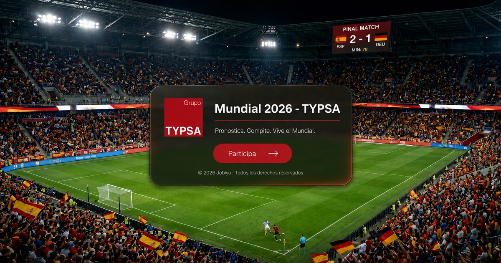

# 🏆 Guía de Uso Oficial — Simulador & Porra Mundial 2026

¡Te damos la bienvenida al **Simulador y Porra del Mundial 2026**! Esta aplicación web te permite pronosticar los resultados de todo el torneo, competir con tus amigos en tiempo real y ver quién se corona como el rey de las predicciones.

Esta guía explica en qué consiste la aplicación, el sistema de puntuación y el rol del administrador.

---

## ⚽ ¿En qué consiste la Porra?

La dinámica del juego es sencilla y competitiva. Consta de **tres fases principales**:

1. **Registro y Pronósticos (Usuario):** cada jugador se registra y completa sus predicciones de Fase de Grupos, eliminatorias (desde Dieciseisavos hasta la Final) y galardones especiales (**Bota de Oro**, **Balón de Oro** y **Guante de Oro**).
2. **Actualización de Resultados (Administrador):** cuando empieza el torneo, el administrador **bloquea** los pronósticos. A medida que se juegan los partidos oficiales, introduce los marcadores reales y los ganadores de premios.
3. **Puntuaciones en Tiempo Real:** el sistema calcula automáticamente la puntuación de cada usuario y actualiza el **Scoreboard**.

---

## 🎮 Flujo de Trabajo para el Usuario (Jugador)

### 1️⃣ Registro e Inicio de Sesión
* **Crear Cuenta:** accede a la pantalla de ingreso e introduce tu **correo electrónico**, una **contraseña** y un **Nick (Nombre de usuario)** que te identificará públicamente en la tabla de clasificaciones.
* **Menú Lateral:** una vez dentro, tendrás acceso a tu panel personal de navegación mediante el menú lateral izquierdo.

### 2️⃣ Sección "Mis Pronósticos" (Fase de Grupos)
* Ingresa en **Mis Pronósticos > Fase de grupos** para pronosticar los partidos de los 12 grupos (**A al L**).
* **Cálculo Automático de Tablas:** a medida que introduces los marcadores, la tabla de posiciones interna se recalcula aplicando criterios oficiales (Puntos, Diferencia de Goles y Goles a Favor).
* **Avance en el Bracket:** al completar los partidos del grupo, las dos mejores selecciones avanzan automáticamente al cuadro interactivo de eliminatorias.

### 3️⃣ Sección "Mis Pronósticos" (Eliminatorias)
* Completa tus pronósticos ronda por ronda: **16avos**, **8avos**, **4tos**, **Semifinales** y **Final**.
* **⚠️ Regla de Oro en Eliminatorias:** no puede haber empates definitivos. Si pronosticas un empate, la app te pedirá que **selecciones al equipo ganador** que avanzará (por penaltis o prórroga).
* Los ganadores se propagan automáticamente a rondas posteriores.

### 4️⃣ Premios y Galardones Especiales
Para ganar puntos adicionales y marcar la diferencia, rellena tus pronósticos especiales en:
* **Bota de Oro:** elige a tus 3 candidatos (seleccionando su selección y el nombre del jugador desde una base de datos real del torneo).
* **Balón de Oro:** predice el mejor jugador del torneo.
* **Guante de Oro:** predice el mejor portero del campeonato.

*💡 Asegúrate de pulsar **Guardar** en cada una de estas pantallas antes de que comience el torneo.*

---

## 📈 Sistema de Puntuaciones (¿Cómo ganar?)

El éxito en la porra depende de la precisión de tus predicciones. Los puntos se calculan únicamente sobre partidos con **resultado real verificado** (ingresado por el administrador).

| Acierto | Descripción | Puntos |
| :--- | :--- | :---: |
| 🎯 **Marcador Exacto** | Acertaste los goles exactos de ambos equipos (ej. Pronóstico: `2 - 1` \| Real: `2 - 1`). | **+4 pts** |
| 🔎 **Tendencia / Ganador** | Acertaste ganador/empate pero no el marcador (ej. Pronóstico: `3 - 1` \| Real: `1 - 0`; o Pronóstico: `1 - 1` \| Real: `2 - 2`). | **+1 pt** |
| ❌ **Sin Acierto** | Fallaste el resultado general (ej. Pronóstico: `1 - 0` \| Real: `0 - 2`). | **0 pts** |

### Puntos extra por galardones
Además de los puntos por partidos, se suman **+10 puntos extra** por cada galardón si aciertas el ganador oficial:
* **Balón de Oro:** **+10 pts**
* **Bota de Oro:** **+10 pts**
* **Guante de Oro:** **+10 pts**

### Criterios de Desempate en el Scoreboard
Si dos o más usuarios empatan en puntuación total en la pestaña **Puntuaciones**, la aplicación desempata automáticamente en este orden:
1. **Puntos Totales:** mayor cantidad de puntos acumulados.
2. **Aciertos Exactos:** mayor cantidad de partidos acertados con marcador exacto (hits de 4 puntos).
3. **Orden Alfabético:** alfabéticamente por correo electrónico del usuario.

---

## 🏅 Premios (Reparto)
Si jugáis la porra con bote económico, el reparto de premios es:
* **70%** para el ganador
* **20%** para el segundo
* **10%** para el tercero

---

## 🛠️ Panel del Administrador (Gestión del Torneo)

El administrador garantiza la transparencia y el correcto funcionamiento de la porra. Sus responsabilidades son:

### 1️⃣ Gestión de Usuarios y Pagos (`/admin-users`)
* **Control de Inscripciones:** puede ver quién se ha registrado y marcarlo como **"Paid" (Pagado)** para gestionar los cobros.
* **Mantenimiento:** permite eliminar usuarios duplicados o reiniciar la porra borrando a todos los usuarios no administradores.

### 2️⃣ Cierre de Predicciones y Cierre de Resultados (`/admin-users`)
* **Cierre de Pronósticos:** con el inicio del torneo, el admin activa el **Bloqueo de Pronósticos**. Desde ese momento, los usuarios no pueden modificar predicciones (partidos o galardones).
* **Bloqueo de Resultados:** una vez finalizado el torneo o cargados todos los resultados, el admin puede bloquear el ingreso de resultados reales para evitar cambios accidentales.

### 3️⃣ Cargar Resultados Reales (`Resultados`)
* El admin ingresa los marcadores reales en **Resultados > Fase de grupos** (y fases eliminatorias).
* En **Resultados > Bota de Oro, Balón de Oro y Guante de Oro**, define los ganadores reales de los premios.

### 4️⃣ Copias de Seguridad (Backup)
* Desde la cabecera superior, el administrador puede usar **Reset** para reiniciar el torneo, o exportar un `.json` de respaldo (**Save Backup**) para resguardar los datos.

---

## 🚀 ¡Que comience el juego!
Regístrate, completa tus pronósticos, analiza el bracket dinámico y mantente atento a **Puntuaciones** a lo largo del Mundial de 2026. ¡Buena suerte!
